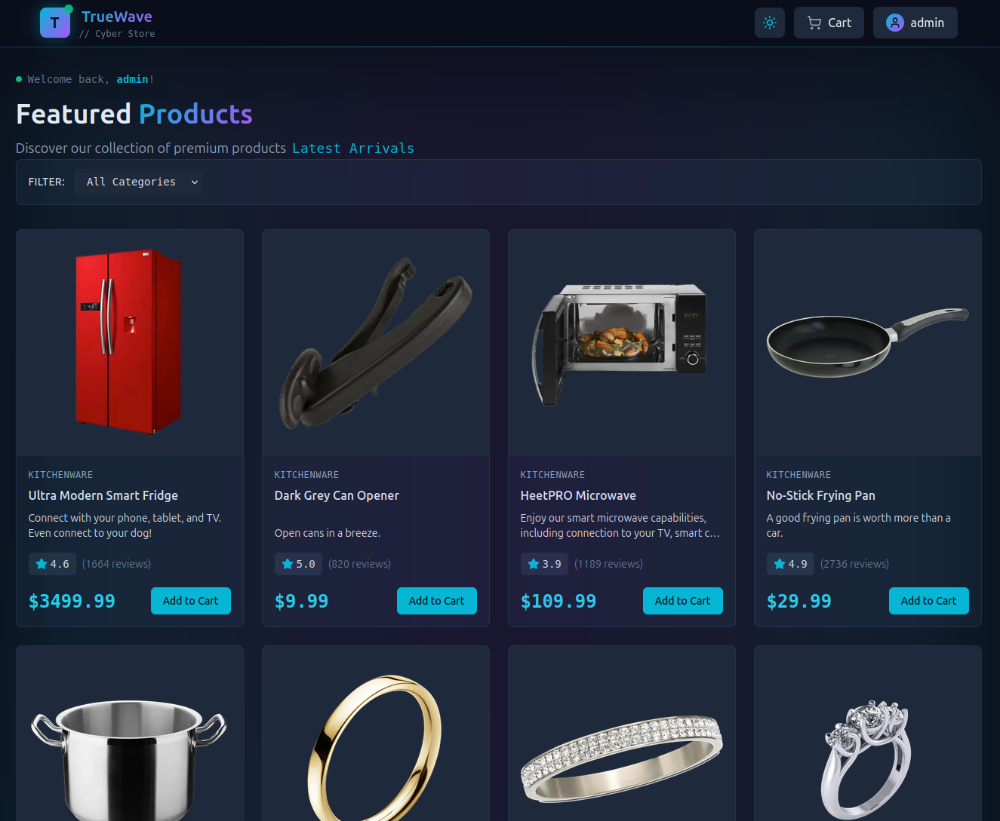
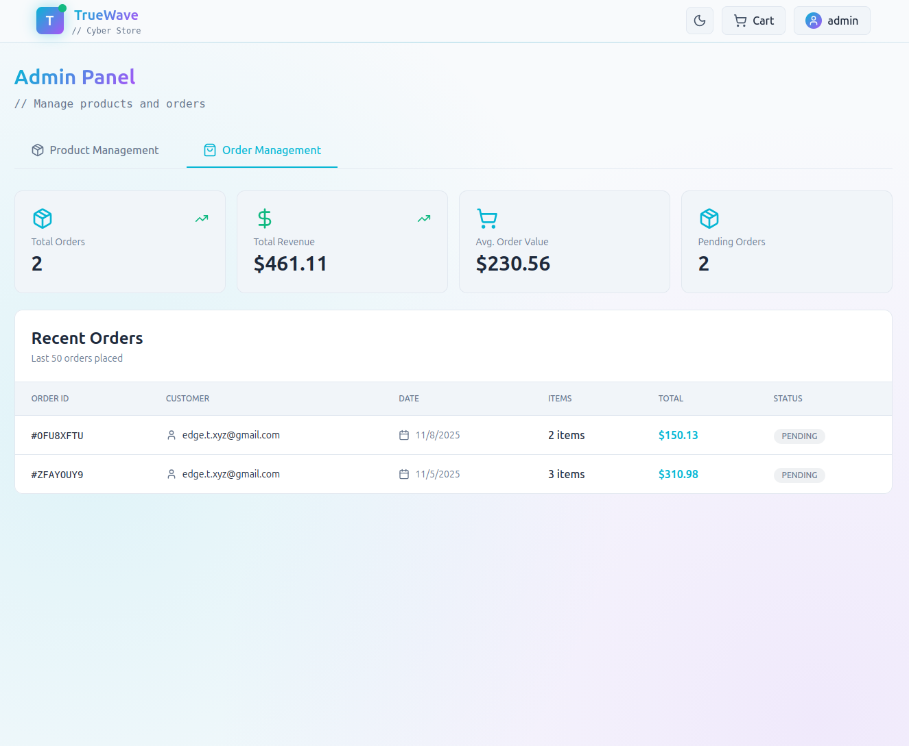
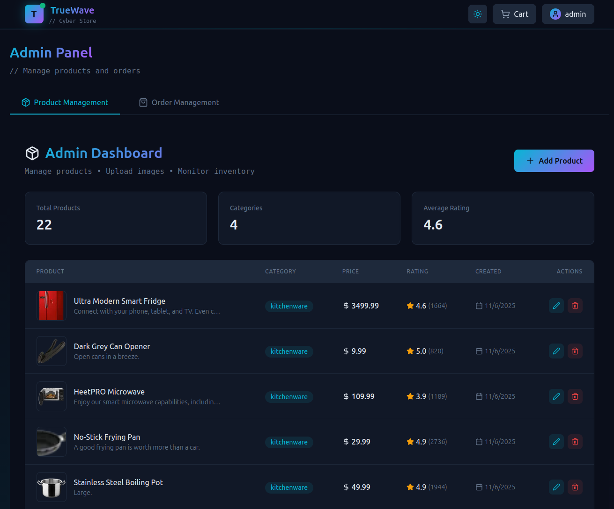
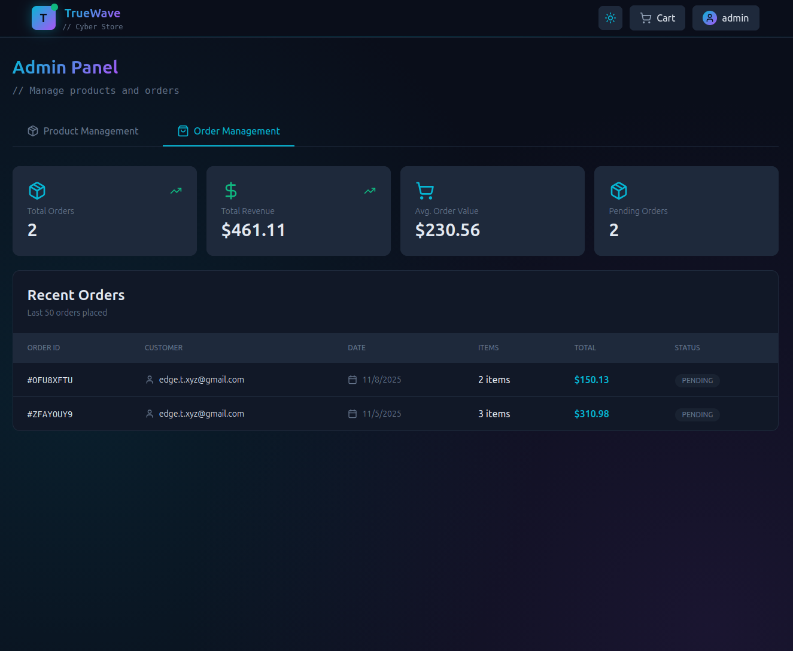
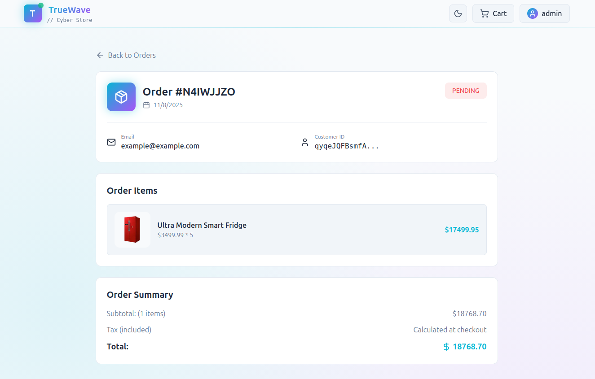

<!-- markdownlint-disable -->

# TrueWave - Cyberpunk E-Commerce Platform

A full-stack e-commerce application with a custom cyberpunk theme that I built to demonstrate modern web development practices. This project started as a React + Vite application but I migrated it to **Next.js 16** to leverage the latest features and create a production-ready architecture.

<div align="center">
  
  
  <p><em>Homepage with dark theme (left) and light theme (right)</em></p>
</div>

## 🎯 Why This Project Exists

I wanted to build something that showcases real-world e-commerce functionality while learning industry-standard tools and patterns. The project evolved from a simple React app into a fully-featured platform with authentication, role-based access control, cart persistence, and a custom theming system.

## 🚀 The Next.js Migration

One of my biggest wins was migrating from React + Vite to **Next.js 16 with the App Router**. This wasn't just a framework switch—it was a complete architectural upgrade:

- **App Router & File-Based Routing** - Replaced React Router with Next.js's intuitive file structure
- **Server Components** - Leveraged RSCs for better performance and smaller client bundles
- **Built-in Image Optimization** - Configured `next/image` with Firebase Storage remote patterns
- **Production Optimizations** - Automatic code splitting, route prefetching, and SEO improvements
- **TypeScript Throughout** - Maintained full type safety during the entire migration

The migration taught me how to think about server vs client components, handle hydration edge cases, and optimize for production deployment on Vercel.

## 🛠️ Tech Stack

### Frontend
- **Next.js 16.0.1** - React framework with App Router and server components
- **React 19.2.0** - Latest React with concurrent features
- **TypeScript 5** - Full type safety across the application
- **Tailwind CSS v4** - Custom cyberpunk theme with design tokens
- **Lucide React** - Modern icon library

### State Management
- **Redux Toolkit 2.10.1** - Global state for auth and cart with custom sync middleware
- **TanStack React Query 5.90.7** - Server state with caching and background refetching
- **React Hot Toast** - Toast notifications

### Backend & Cloud
- **Firebase 12.5.0**
  - **Authentication** - Email/password auth and profile management
  - **Cloud Firestore** - NoSQL database for products, orders, and users
  - **Cloud Storage** - Image hosting organized by category
  - **Cloud Functions** - Serverless triggers for automated data cleanup

### Development Tools
- **ESLint 9** - Code quality and consistency
- **pnpm** - Fast, disk-efficient package manager

## ✨ Features & Functionality

### Customer Experience
- **Authentication System** - Complete email/password registration and login flows with Firebase Auth
- **Shopping Cart** - Add/remove products, adjust quantities, cart persists across sessions
- **Dynamic Theme Switching** - Custom dark/light mode toggle with localStorage persistence
- **Profile Management** - Update display name, photo URL, and view complete order history
- **Product Browsing** - Filter by categories (electronics, clothing, home, sports, books, toys)
- **Order System** - Checkout flow with tax calculation, order placement, and order tracking
- **Responsive Design** - Fully mobile-friendly with Tailwind breakpoints

### Admin Dashboard
- **Product Management** - Full CRUD operations for the product catalog
- **Image Upload System** - Direct uploads to Firebase Storage with progress tracking
- **Order Management** - View all customer orders with revenue metrics and status updates
- **Role-Based Access** - Admin-only routes with Firestore-based permission checks
- **Tabbed Interface** - Clean navigation between products and orders management

<div align="center">
  
  
  <p><em>Admin Dashboard: Product Management (left) and Order Management (right)</em></p>

  
  <p><em>Admin Dashboard in light theme showcasing theme flexibility</em></p>
</div>

### Technical Highlights
- **Cloud Functions** - Automated user/cart cleanup with Firestore triggers and batched writes
- **Cart Sync Middleware** - Custom Redux middleware keeps cart synced with Firestore
- **Optimized Images** - Next.js Image with Firebase Storage remote patterns
- **Smart Caching** - React Query handles server state with background refetching
- **Type Safety** - Full TypeScript coverage with custom interfaces

## 🏗️ Project Architecture

```
my-app/
├── app/                              # Next.js App Router (file-based routing)
│   ├── admin/                        # Protected admin dashboard
│   ├── cart/                         # Shopping cart view
│   ├── login/ & register/           # Authentication pages
│   ├── orders/                       # Order history
│   │   └── [orderId]/               # Dynamic route for order details
│   ├── profile/                      # User profile management
│   ├── layout.tsx                    # Root layout (providers, metadata)
│   ├── page.tsx                      # Homepage with product grid
│   └── globals.css                   # Tailwind v4 with custom theme tokens
├── components/
│   ├── admin/                        # Admin-only components
│   │   ├── AdminPanel.tsx           # Tabbed interface
│   │   ├── ProductForm.tsx          # Product CRUD
│   │   └── OrderManagement.tsx      # Order dashboard
│   ├── cart/
│   │   ├── ShoppingCart.tsx         # Cart display & checkout
│   │   └── CartItem.tsx             # Individual cart item
│   ├── layout/
│   │   ├── Header.tsx               # Navigation with user dropdown
│   │   └── ClientLayout.tsx         # Client-side layout wrapper
│   └── products/
│       ├── ProductList.tsx          # Product grid
│       ├── ProductCard.tsx          # Product display
│       └── CategoryFilter.tsx       # Category filtering
├── lib/
│   ├── firebase.ts                   # Firebase initialization
│   ├── services/                     # Service layer pattern
│   │   ├── authService.ts           # Auth operations
│   │   ├── firestoreService.ts      # Database operations
│   │   └── storageService.ts        # File upload/download
│   ├── store/                        # Redux Toolkit
│   │   ├── store.ts                 # Store configuration
│   │   ├── authSlice.ts             # Auth state management
│   │   ├── cartSlice.ts             # Cart state management
│   │   └── cartSyncMiddleware.ts    # Firestore sync middleware
│   └── utils/
│       ├── toasts.ts                # Toast notification helpers
│       ├── storage.ts               # LocalStorage/SessionStorage helpers
│       └── dateHelpers.ts           # Date formatting utilities
├── hooks/                            # Custom React hooks
│   ├── store.ts                      # Typed Redux hooks
│   ├── useProducts.ts               # React Query product hooks
│   └── useOrders.ts                 # React Query order hooks
├── types/                            # TypeScript type definitions
│   ├── product.ts                   # Product interface
│   ├── order.ts                     # Order & OrderItem interfaces
│   └── user.ts                      # User interface
├── functions/                        # Firebase Cloud Functions
│   └── src/
│       └── index.ts                 # User cleanup & cart management functions
└── public/                           # Static assets
```

## 🚦 Getting Started

### Prerequisites
- Node.js 18+
- pnpm (or npm/yarn)
- Firebase project with Auth, Firestore, and Storage enabled

### Installation

1. Clone the repository:
```bash
git clone <repository-url>
cd my-app
```

2. Install dependencies:
```bash
pnpm install
```

3. Create `.env.local` file with Firebase credentials:
```env
NEXT_PUBLIC_FIREBASE_API_KEY=your_api_key
NEXT_PUBLIC_FIREBASE_AUTH_DOMAIN=your_auth_domain
NEXT_PUBLIC_FIREBASE_PROJECT_ID=your_project_id
NEXT_PUBLIC_FIREBASE_STORAGE_BUCKET=your_storage_bucket
NEXT_PUBLIC_FIREBASE_MESSAGING_SENDER_ID=your_sender_id
NEXT_PUBLIC_FIREBASE_APP_ID=your_app_id
```

4. Run the development server:
```bash
pnpm dev
```

5. Open [http://localhost:3000](http://localhost:3000)

## 🎨 Custom Cyberpunk Theme

Built using Tailwind CSS v4's design token system:

- **CSS Variables** - Semantic color tokens in `globals.css` with `@theme` directive
- **Dual Themes** - Dark/light modes with localStorage persistence
- **Custom Utilities** - Gradient backgrounds (`bg-gradient-cyber`) and glow effects (`shadow-cyan`)
- **Color Palette** - Cyan (#06b6d4), purple (#a855f7), pink (#ec4899) accents
- **Layered Design** - Gradients and textures for depth

## 🔥 Firebase Backend Architecture

### Firestore Database Schema
I designed a NoSQL schema optimized for real-time queries:

**`products` Collection**
```typescript
{
  id: string;
  title: string;
  description: string;
  price: number;
  category: 'electronics' | 'clothing' | 'home' | 'sports' | 'books' | 'toys';
  imageURL: string;
  rating: number;
  ratingCount: number;
  stock: number;
  createdAt: Timestamp;
  updatedAt: Timestamp;
}
```

**`users` Collection**
```typescript
{
  uid: string;
  email: string;
  displayName: string;
  photoURL: string;
  isAdmin: boolean;
  createdAt: Timestamp;
}
```

**`orders` Collection**
```typescript
{
  id: string;
  userId: string;
  userEmail: string;
  items: OrderItem[];
  totalAmount: number;
  status: 'pending' | 'processing' | 'shipped' | 'delivered' | 'cancelled';
  createdAt: Timestamp;
}
```

**`carts` Collection** (synced with Redux)
```typescript
{
  userId: string;
  items: CartItem[];
  updatedAt: Timestamp;
}
```

### Firebase Storage Organization
Product images are organized by category for efficient retrieval:
```
products/
  ├── electronics/product123_timestamp.jpg
  ├── clothing/product456_timestamp.jpg
  ├── home/product789_timestamp.jpg
  └── sports/product101_timestamp.jpg
```

### Cloud Functions (Serverless)
Automated cleanup using Firebase Functions v2:

- **`onUserDeleted`** - Removes auth account, cart, and orders when user deleted
- **`onProductDeleted`** - Removes deleted products from all carts
- **`cleanupUserData`** - Callable function for manual cleanup

Functions use batched writes (500 operations per batch) for efficiency.

## 🔄 React → Next.js 16 Migration

Key changes during the migration:

**State Management Strategy**
- Kept Redux Toolkit for cart/auth (needs localStorage persistence)
- Migrated to React Query for products/orders (eliminates manual `useEffect` patterns)
- Built custom cart sync middleware to keep Redux and Firestore in sync

**Component & Routing**
- Learned `'use client'` vs server component boundaries
- Replaced React Router with App Router's file-based routing
- Implemented dynamic routes: `app/orders/[orderId]/page.tsx`

**Image Optimization**
- Converted all `` to `<Image>` with Firebase Storage remote patterns
- Significant performance boost with automatic WebP conversion

**React 19 Compatibility**
- Fixed strict mode warnings with lazy initializers
- Solved hydration mismatches from localStorage reads during SSR

## � Key Skills Demonstrated

**Frontend & Architecture**
- Next.js 16 App Router with server/client component patterns
- React 19 with strict mode compliance and proper hook patterns
- TypeScript type safety with custom interfaces and generics
- Tailwind CSS v4 custom theme system with design tokens

**State Management**
- Redux Toolkit with custom cart sync middleware
- React Query for server state with caching and background refetching
- Service layer pattern separating UI from data access

**Backend & Cloud**
- Firebase Authentication with email/password flows
- Cloud Firestore NoSQL schema design and queries
- Firebase Storage with category-based organization
- Cloud Functions with Firestore triggers and batched writes

**Real-World Features**
- E-commerce cart with session persistence
- Admin dashboard with role-based access control
- Image upload with progress tracking
- Order management with checkout flow
- Dynamic routing and category filtering

## 🚀 Deployment

**Vercel (Frontend)**
```bash
pnpm run build && pnpm start  # Test locally
# Deploy: Push to GitHub → Import in Vercel → Add env vars → Auto-deploy
```

**Firebase (Cloud Functions)**
```bash
cd functions && pnpm run build
firebase deploy --only functions
```

## 🔮 Future Plans

- Stripe payment integration
- Full-text search with Algolia
- Product reviews and ratings
- Email notifications (SendGrid)
- CI/CD pipeline with GitHub Actions

See [ROADMAP2.md](./ROADMAP2.md) for details.

## 🎓 Takeaways

This project taught me that building a real-world application involves much more than just writing code. It requires:

- **Architecture Planning** - Making decisions about state management, data flow, and component structure
- **Migration Skills** - Refactoring an entire codebase while maintaining functionality
- **Problem Solving** - Debugging hydration issues, optimizing performance, handling edge cases
- **User Experience** - Loading states, error handling, responsive design, and accessibility
- **Production Mindset** - Security rules, environment variables, deployment strategies, and monitoring

The jump from React to Next.js pushed me to understand server/client boundaries, SSR, and production optimizations. Working with Firebase taught me about NoSQL design, security rules, and serverless functions. Building the custom theming system deepened my CSS knowledge with Tailwind v4's new features.

Most importantly, I learned how to research, debug, and persist through challenges when building something complex from scratch.

---

**Built with Next.js, TypeScript, Firebase, and a lot of coffee** ☕

*The cyberpunk aesthetic was inspired by my love for sci-fi and neon-soaked cityscapes. If you're a recruiter or fellow developer, feel free to reach out!*
